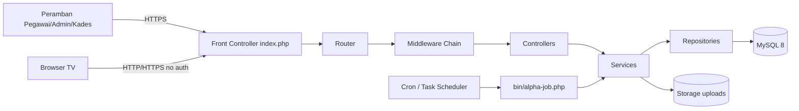
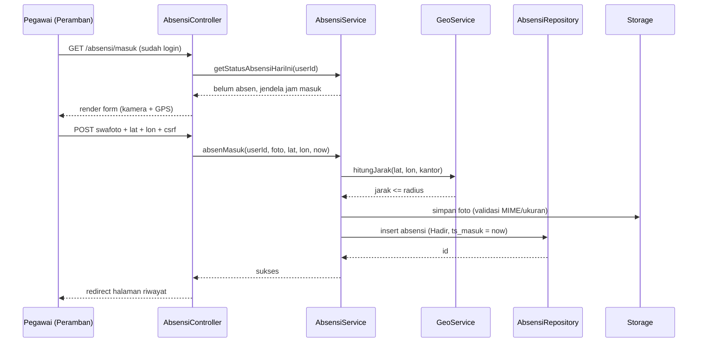
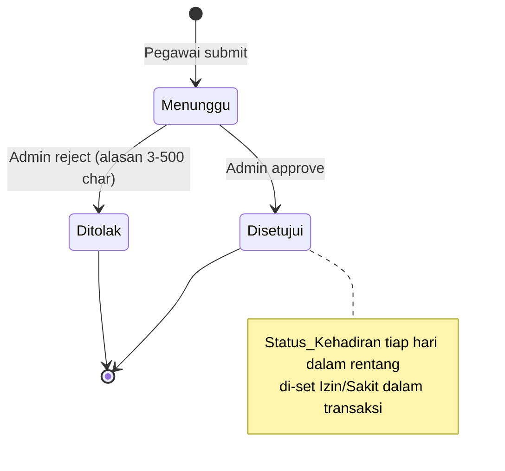
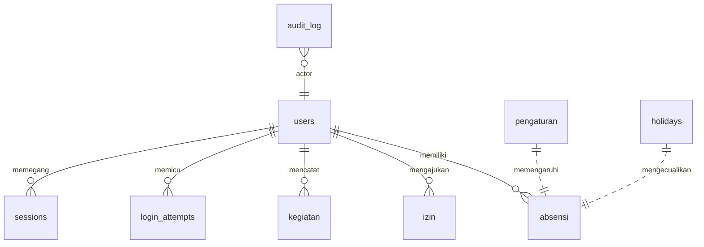

# Design Document

## Overview

Sistem Absensi Desa Wadas adalah aplikasi web monolitik yang dibangun menggunakan PHP 8.x native, MySQL 8.x, dan front-end berbasis HTML/CSS/JavaScript dengan Bootstrap 5. Sistem mencatat kehadiran harian perangkat desa dengan validasi berlapis (kredensial, swafoto, GPS), mengelola pengajuan izin/sakit, register kegiatan harian, rekap dan laporan bulanan, serta menyajikan papan kehadiran publik untuk TV.

Tujuan utama desain:

- **Sederhana**: Menggunakan PHP native dengan front controller tunggal (`public/index.php`) sebagai router agar tidak bergantung pada framework besar.
- **Aman**: Validasi sisi server untuk seluruh masukan, prepared statement untuk semua query, hash password, CSRF token, escaping output, kontrol akses berbasis peran, dan audit log untuk aksi sensitif.
- **Akurat**: Menggunakan waktu server dan zona waktu Asia/Jakarta (WIB, UTC+7) untuk semua catatan kehadiran, sehingga tidak bergantung pada jam perangkat klien.
- **Terisolasi per peran**: Pemisahan tegas antara Pegawai, Admin (Kaur Pemerintahan), dan Kepala Desa pada lapisan controller dan middleware.
- **Mudah dioperasikan**: Display Board dapat dijalankan tanpa login pada TV, dengan auto-refresh tiap 60 detik.

Pertimbangan teknologi utama:

- **PHP 8.x** — fitur typed properties, enums, dan named arguments untuk membuat domain model lebih jelas.
- **MySQL 8.x** — InnoDB untuk transaksi (penting untuk konsistensi audit log + aksi yang dipicu, dan generator Alpha).
- **Bootstrap 5** — komponen UI siap pakai, mendukung responsif untuk perangkat Pegawai (mobile) dan TV (large screen).
- **dompdf** atau **mpdf** — pustaka pembuat PDF berbasis PHP, dipilih dompdf karena lebih ringan untuk laporan tabular sederhana.
- **getUserMedia + Geolocation API** — untuk swafoto dan koordinat GPS pada peramban.
- **Cron / Task Scheduler Windows** — untuk job penetapan status Alpha harian.

## Architecture

### Pola Arsitektur

Sistem mengikuti pola **Modular MVC ringan** dengan front controller tunggal:

- **Front Controller** (`public/index.php`): titik masuk semua permintaan HTTP, melakukan bootstrap (autoload, sesi, CSRF, koneksi DB) dan men-dispatch ke router.
- **Router** (`src/Core/Router.php`): memetakan URL ke controller berdasarkan tabel rute. Mendukung middleware per rute.
- **Middleware**: rantai pra-eksekusi yang menangani autentikasi (`AuthMiddleware`), otorisasi peran (`RoleMiddleware`), validasi CSRF (`CsrfMiddleware`), dan rate limit login (`LoginThrottleMiddleware`).
- **Controllers**: satu controller per modul (AuthController, AbsensiController, IzinController, KegiatanController, PegawaiController, PengaturanController, RekapController, LaporanController, DashboardController, DisplayBoardController, RiwayatController).
- **Services**: lapisan logika bisnis murni (mis. `AbsensiService`, `IzinService`, `RekapService`, `AlphaJobService`, `GeoService`). Service tidak menyentuh `$_GET`/`$_POST` agar mudah diuji.
- **Repositories**: pembungkus PDO yang mengeksekusi prepared statement dan mengembalikan domain object atau array typed.
- **Views**: template PHP dalam `templates/` dengan layout dasar Bootstrap.

### Struktur Direktori

```
public/
  index.php              # Front controller (rewriting via .htaccess / nginx)
  assets/                # css, js, img
  uploads/.htaccess      # Deny direct execution; downloads via Sistem
src/
  Core/
    Router.php
    Request.php
    Response.php
    Session.php
    Csrf.php
    Db.php               # PDO factory
    Config.php           # baca config/*.php
    Logger.php           # PSR-3-like logger ke storage/logs
    Time.php             # Clock injectable (Asia/Jakarta)
  Middleware/
    AuthMiddleware.php
    RoleMiddleware.php
    CsrfMiddleware.php
    LoginThrottleMiddleware.php
  Controllers/
    AuthController.php
    AbsensiController.php
    IzinController.php
    KegiatanController.php
    PegawaiController.php
    PengaturanController.php
    RekapController.php
    LaporanController.php
    DashboardController.php
    DisplayBoardController.php
    RiwayatController.php
  Services/
    AuthService.php
    AbsensiService.php
    IzinService.php
    KegiatanService.php
    PegawaiService.php
    PengaturanService.php
    RekapService.php
    LaporanService.php
    AlphaJobService.php
    GeoService.php
    AuditLogService.php
    UploadService.php
  Repositories/
    UserRepository.php
    AbsensiRepository.php
    IzinRepository.php
    KegiatanRepository.php
    PegawaiRepository.php
    PengaturanRepository.php
    AuditLogRepository.php
    LoginAttemptRepository.php
    HoliDayRepository.php
  Domain/
    Enums/Role.php, AttendanceStatus.php, IzinStatus.php
    Entities/User.php, Absensi.php, Izin.php, Kegiatan.php, Pegawai.php
    Validators/...
config/
  app.php
  database.php
storage/
  uploads/swafoto/<YYYY>/<MM>/
  uploads/izin/<YYYY>/<MM>/
  logs/
templates/
  layouts/...
  pegawai/...
  admin/...
  kepala/...
  display/...
bin/
  alpha-job.php          # dijalankan via cron / Task Scheduler
tests/
  unit/...
  property/...           # property-based tests (PHPUnit + eris)
```

### Diagram Komponen Tingkat Tinggi



### Diagram Alur Absensi Masuk



### Diagram Alur Persetujuan Izin



### Pertimbangan Lintas-Modul

- **Zona waktu**: PHP `date_default_timezone_set('Asia/Jakarta')` dilakukan saat bootstrap. MySQL dijalankan dengan `time_zone = '+07:00'` per koneksi.
- **Sumber waktu kanonik**: setiap timestamp absensi/izin/audit log diambil dari `Clock::now()` di server, bukan dari klien.
- **Transaksi**: aksi sensitif yang harus konsisten dengan audit log (Requirement 19) dijalankan dalam satu transaksi DB. Jika `auditLogService->record()` gagal, transaksi di-rollback.
- **Locale**: pesan kesalahan ditampilkan dalam Bahasa Indonesia sesuai requirements.

## Components and Interfaces

### Modul Autentikasi (AuthService, AuthController)

Antarmuka utama:

```php
final class AuthService {
    public function login(string $username, string $password, string $ip): LoginResult;
    public function logout(string $sessionId): void;
    public function isSessionValid(string $sessionId, DateTimeImmutable $now): bool;
    public function rotateToken(string $sessionId): string;
}

final class LoginResult {
    public bool $success;
    public ?int $userId;
    public ?Role $role;
    public ?string $errorCode;     // INVALID_CREDENTIALS | ACCOUNT_LOCKED | INVALID_INPUT
    public ?int $lockSecondsLeft;  // jika ACCOUNT_LOCKED
}
```

Aturan kunci:

- Hash password: `password_hash($p, PASSWORD_DEFAULT)`; verifikasi `password_verify`.
- Throttle: setelah 5 percobaan gagal pada akun yang sama dalam 10 menit (Requirement 1.3), kunci akun 15 menit. Penghitung gagal disimpan pada `login_attempts`.
- Validasi panjang username (1-50) dan password (8-72) dilakukan sebelum query DB; permintaan dengan panjang melanggar tidak diperhitungkan ke throttle (Requirement 1.6).
- Sesi: cookie `PHPSESSID` dengan `HttpOnly`, `SameSite=Lax`, `Secure` jika HTTPS. Umur token 60 menit dari pembuatan, idle timeout 30 menit (Requirement 3.2).

### Modul Absensi (AbsensiService, AbsensiController)

```php
final class AbsensiService {
    public function getStatusHariIni(int $userId, DateTimeImmutable $now): StatusAbsensiHariIni;
    public function absenMasuk(int $userId, UploadedFile $foto, float $lat, float $lon, DateTimeImmutable $now): AbsenResult;
    public function absenTerlambat(int $userId, UploadedFile $foto, float $lat, float $lon, string $alasan, DateTimeImmutable $now): AbsenResult;
    public function absenPulang(int $userId, UploadedFile $foto, float $lat, float $lon, DateTimeImmutable $now): AbsenResult;
}
```

Aturan jendela waktu:

- Jendela ditentukan oleh `Pengaturan` aktif: `jam_masuk_mulai`, `jam_masuk_selesai`, `jam_terlambat_selesai`, `jam_pulang_mulai`.
- Hari kerja default Senin-Jumat (`hari_kerja_mask` bitmask 7 bit). Hari libur nasional disimpan di tabel `holidays`.
- Pemilihan status saat absen masuk: `Hadir` jika `now ∈ [masuk_mulai, masuk_selesai)`, `Terlambat` jika `now ∈ [masuk_selesai, terlambat_selesai)`, lainnya ditolak.
- Absen pulang: `now ∈ [pulang_mulai, 23:59:59]` dan harus sudah ada `ts_masuk`.

Validasi swafoto + GPS:

- MIME diperiksa dengan `finfo_file` dan ekstensi pada whitelist.
- Ukuran maks 2 MB (Requirement 4.6/4.7) untuk swafoto, tetapi limit upper-bound umum 5 MB pada layer keamanan (Requirement 20.6).
- Jarak dihitung dengan **Haversine formula** pada `GeoService::haversine($lat1,$lon1,$lat2,$lon2): float` (meter).

### Modul Izin (IzinService, IzinController)

```php
final class IzinService {
    public function ajukanIzin(int $pegawaiId, IzinJenis $jenis, DateImmutable $mulai, DateImmutable $selesai, string $keterangan, ?UploadedFile $lampiran): IzinSubmitResult;
    public function setujui(int $izinId, int $adminId): IzinDecisionResult;
    public function tolak(int $izinId, int $adminId, string $alasan): IzinDecisionResult;
    public function listMenunggu(int $page, int $perPage = 25): Paginated;
}
```

Aturan kunci:

- Validasi tumpang tindih: query mencari izin dengan status `Menunggu` atau `Disetujui` milik pegawai yang sama, di mana `[mulai_existing, selesai_existing]` beririsan dengan `[mulai_baru, selesai_baru]`.
- Saat persetujuan, dalam satu transaksi DB: update status izin -> insert/update `absensi` per hari pada rentang tanggal dengan `Status_Kehadiran` = `Izin`/`Sakit` (jika sudah ada catatan untuk tanggal tsb, update; gunakan `INSERT ... ON DUPLICATE KEY UPDATE` dengan unique key `(pegawai_id, tanggal)`).

### Modul Kegiatan (KegiatanService)

```php
final class KegiatanService {
    public function tambah(int $pegawaiId, string $nama, string $jamMulai, string $jamSelesai, DateImmutable $tanggal): KegiatanResult;
    public function listHariIni(int $pegawaiId, DateImmutable $tanggal): array;
}
```

Validasi: nama 3-200 char setelah trim, format HH:MM, `jam_mulai < jam_selesai`, `tanggal` adalah hari kerja.

### Modul Pegawai (PegawaiService)

```php
final class PegawaiService {
    public function tambah(NewPegawaiInput $input, int $adminId): PegawaiResult;
    public function ubah(int $pegawaiId, UpdatePegawaiInput $input, int $adminId): PegawaiResult;
    public function nonaktifkan(int $pegawaiId, int $adminId): PegawaiResult;
}
```

Aturan: NIP 18 digit numerik, username alfanumerik 4-30, password awal min 8 char (di-hash). Saat nonaktifkan, semua sesi pegawai tersebut diinvalidasi (`UPDATE sessions SET revoked_at = NOW() WHERE user_id = ?`).

### Modul Pengaturan (PengaturanService)

```php
final class PengaturanService {
    public function getAktif(): Pengaturan;
    public function simpan(PengaturanInput $input, int $adminId): PengaturanResult;
}
```

Validasi: urutan `masuk_mulai < masuk_selesai < terlambat_selesai < pulang_mulai`, latitude/longitude dalam rentang valid, radius 10-5000 m.

### Modul Rekap dan Laporan (RekapService, LaporanService)

```php
final class RekapService {
    public function rekapBulanan(int $bulan, int $tahun): RekapBulanan;
    public function rekapHarianPegawai(int $pegawaiId, int $bulan, int $tahun): RekapHarian;
}

final class LaporanService {
    public function pdfRekapBulanan(int $bulan, int $tahun): string; // path/blob
    public function pdfDetailPegawai(int $pegawaiId, int $bulan, int $tahun): string;
}
```

`RekapService` menggunakan SQL `GROUP BY` pada `absensi` yang difilter berdasar bulan/tahun. Total Hari Kerja dihitung dari fungsi PHP `Calendar::workingDaysInMonth` mempertimbangkan `hari_kerja_mask` dan `holidays`.

### Modul Dashboard dan Display Board

```php
final class DashboardService {
    public function ringkasanHariIni(DateImmutable $tanggal): DashboardSnapshot;
    public function ringkasanBulanBerjalan(int $bulan, int $tahun): MonthSnapshot;
}
```

Display Board memakai endpoint JSON ringan (`GET /display/data`) yang dipanggil tiap 60 detik via JavaScript. Endpoint ini caching 30 detik di memori (file cache) untuk menahan beban.

### Modul Audit Log

```php
final class AuditLogService {
    public function record(int $actorUserId, string $action, string $targetType, ?int $targetId, array $before, array $after, DateTimeImmutable $now): void;
}
```

Tabel `audit_log` `INSERT only`. Tidak ada endpoint UPDATE/DELETE.

## Data Models

### Skema Database



#### Tabel `users`

Menyimpan akun semua peran (Pegawai, Admin, Kepala Desa).

| Kolom         | Tipe                                                   | Catatan                                |
| ------------- | ------------------------------------------------------ | -------------------------------------- |
| id            | INT UNSIGNED PK AUTO_INCREMENT                         |                                        |
| nip           | VARCHAR(18)                                            | UNIQUE, hanya untuk Pegawai (nullable) |
| username      | VARCHAR(30)                                            | UNIQUE                                 |
| password_hash | VARCHAR(255)                                           | hash bcrypt                            |
| nama          | VARCHAR(100)                                           |                                        |
| jabatan       | VARCHAR(100)                                           |                                        |
| role          | ENUM('Pegawai','Admin','KepalaDesa')                   |                                        |
| status        | ENUM('Aktif','Nonaktif')                               | default 'Aktif'                        |
| created_at    | DATETIME                                               |                                        |
| updated_at    | DATETIME                                               |                                        |

Index: `UNIQUE(username)`, `UNIQUE(nip)` (NULLs allowed multiple), `INDEX(status, role)`.

#### Tabel `sessions`

| Kolom        | Tipe                | Catatan                          |
| ------------ | ------------------- | -------------------------------- |
| id           | CHAR(40) PK         | session id (random_bytes hex)    |
| user_id      | INT UNSIGNED FK     |                                  |
| created_at   | DATETIME            | umur token (60 menit)            |
| last_seen_at | DATETIME            | idle timeout (30 menit)          |
| revoked_at   | DATETIME NULL       | logout / nonaktif                |
| ip           | VARCHAR(45)         |                                  |
| user_agent   | VARCHAR(255)        |                                  |

#### Tabel `login_attempts`

| Kolom        | Tipe                | Catatan                                    |
| ------------ | ------------------- | ------------------------------------------ |
| id           | BIGINT PK           |                                            |
| username     | VARCHAR(30)         | tidak case-sensitive                       |
| success      | TINYINT(1)          |                                            |
| ip           | VARCHAR(45)         |                                            |
| attempted_at | DATETIME            |                                            |

Index: `INDEX(username, attempted_at)`.

#### Tabel `pengaturan`

Menyimpan satu baris aktif (id = 1) plus revisi historis bila perlu (versioning ringan via tabel `pengaturan_history`).

| Kolom                | Tipe          | Catatan                              |
| -------------------- | ------------- | ------------------------------------ |
| id                   | TINYINT PK    | selalu 1                             |
| jam_masuk_mulai      | TIME          |                                      |
| jam_masuk_selesai    | TIME          |                                      |
| jam_terlambat_selesai| TIME          |                                      |
| jam_pulang_mulai     | TIME          |                                      |
| latitude             | DECIMAL(10,7) | -90..90                              |
| longitude            | DECIMAL(10,7) | -180..180                            |
| radius_meter         | INT UNSIGNED  | 10..5000                             |
| hari_kerja_mask      | TINYINT       | bitmask Senin..Minggu, default 0b0011111 |
| updated_at           | DATETIME      |                                      |
| updated_by           | INT UNSIGNED  | FK users.id                          |

#### Tabel `holidays`

| Kolom    | Tipe        | Catatan         |
| -------- | ----------- | --------------- |
| tanggal  | DATE PK     | hari libur      |
| nama     | VARCHAR(100)|                 |

#### Tabel `absensi`

| Kolom            | Tipe                                                        | Catatan                         |
| ---------------- | ----------------------------------------------------------- | ------------------------------- |
| id               | BIGINT PK                                                   |                                 |
| pegawai_id       | INT UNSIGNED FK users.id                                    |                                 |
| tanggal          | DATE                                                        |                                 |
| status           | ENUM('Hadir','Terlambat','Izin','Sakit','Alpha')            |                                 |
| ts_masuk         | DATETIME NULL                                               |                                 |
| ts_pulang        | DATETIME NULL                                               |                                 |
| lat_masuk        | DECIMAL(10,7) NULL                                          |                                 |
| lon_masuk        | DECIMAL(10,7) NULL                                          |                                 |
| lat_pulang       | DECIMAL(10,7) NULL                                          |                                 |
| lon_pulang       | DECIMAL(10,7) NULL                                          |                                 |
| swafoto_masuk    | VARCHAR(255) NULL                                           | path relatif ke storage         |
| swafoto_pulang   | VARCHAR(255) NULL                                           |                                 |
| alasan_terlambat | VARCHAR(500) NULL                                           |                                 |
| sumber           | ENUM('manual','auto')                                       | 'auto' untuk Alpha otomatis     |
| created_at       | DATETIME                                                    |                                 |
| updated_at       | DATETIME                                                    |                                 |

Index unik: `UNIQUE(pegawai_id, tanggal)` — memastikan tepat satu catatan per pegawai per hari (mendukung Requirement 5.4, 6.5, 7.4, dan idempotensi job Alpha).

#### Tabel `izin`

| Kolom               | Tipe                                                 | Catatan |
| ------------------- | ---------------------------------------------------- | ------- |
| id                  | BIGINT PK                                            |         |
| pegawai_id          | INT UNSIGNED FK                                      |         |
| jenis               | ENUM('Izin','Sakit')                                 |         |
| tanggal_mulai       | DATE                                                 |         |
| tanggal_selesai     | DATE                                                 |         |
| keterangan          | VARCHAR(500)                                         |         |
| status              | ENUM('Menunggu','Disetujui','Ditolak')               |         |
| lampiran_path       | VARCHAR(255) NULL                                    |         |
| alasan_penolakan    | VARCHAR(500) NULL                                    |         |
| decided_by          | INT UNSIGNED NULL                                    | admin   |
| decided_at          | DATETIME NULL                                        |         |
| nomor_referensi     | CHAR(12)                                             | UNIQUE  |
| created_at          | DATETIME                                             |         |

Index: `INDEX(pegawai_id, status, tanggal_mulai, tanggal_selesai)` untuk deteksi tumpang tindih.

#### Tabel `kegiatan`

| Kolom        | Tipe              | Catatan |
| ------------ | ----------------- | ------- |
| id           | BIGINT PK         |         |
| pegawai_id   | INT UNSIGNED FK   |         |
| tanggal      | DATE              |         |
| nama         | VARCHAR(200)      |         |
| jam_mulai    | TIME              |         |
| jam_selesai  | TIME              |         |
| created_at   | DATETIME          |         |

Index: `INDEX(pegawai_id, tanggal, jam_mulai)`.

#### Tabel `audit_log`

| Kolom         | Tipe                | Catatan                         |
| ------------- | ------------------- | ------------------------------- |
| id            | BIGINT PK           |                                 |
| actor_user_id | INT UNSIGNED        |                                 |
| actor_nama    | VARCHAR(100)        | denormalized snapshot           |
| action        | VARCHAR(50)         | create/update/deactivate/approve/reject/setting_update |
| target_type   | VARCHAR(50)         | user, izin, pengaturan          |
| target_id     | BIGINT NULL         |                                 |
| before_json   | JSON NULL           |                                 |
| after_json    | JSON NULL           |                                 |
| created_at    | DATETIME(3)         | ISO 8601 dengan ms              |

Tabel ini diberi privilege khusus (hanya `INSERT, SELECT` untuk role aplikasi), dan tidak diakses melalui endpoint `UPDATE/DELETE`.

### Domain Enums

```php
enum Role: string { case Pegawai='Pegawai'; case Admin='Admin'; case KepalaDesa='KepalaDesa'; }
enum AttendanceStatus: string { case Hadir='Hadir'; case Terlambat='Terlambat'; case Izin='Izin'; case Sakit='Sakit'; case Alpha='Alpha'; }
enum IzinStatus: string { case Menunggu='Menunggu'; case Disetujui='Disetujui'; case Ditolak='Ditolak'; }
enum IzinJenis: string { case Izin='Izin'; case Sakit='Sakit'; }
```

### Penyimpanan Berkas

- Direktori `storage/uploads/swafoto/<YYYY>/<MM>/<uuid>.<ext>` dan `storage/uploads/izin/...`.
- `.htaccess` di `storage/uploads/` berisi `php_flag engine off` dan `Require all denied`.
- Endpoint pengunduhan terotentikasi: `GET /file/{type}/{id}` (Sistem mengecek role dan kepemilikan sebelum mengirim berkas).


## Correctness Properties

*Property adalah karakteristik atau perilaku yang harus selalu benar untuk setiap eksekusi sah dari Sistem; ia merupakan pernyataan formal tentang apa yang harus dilakukan Sistem. Properti menjadi jembatan antara spesifikasi yang dapat dibaca manusia dan jaminan kebenaran yang dapat diverifikasi mesin.*

Setelah menganalisis 20 requirement (lihat prework), banyak properti dapat digabung untuk menghilangkan redundansi. Berikut daftar final properti yang akan diuji dengan property-based testing.

### Property 1: Login berhasil membuat sesi dan menyimpan password ter-hash

*For any* akun aktif dengan username (1-50 karakter) dan password (8-72 karakter) yang disimpan, login dengan kredensial yang sama harus mengembalikan sukses, membuat sesi yang valid pada server selama maksimum 60 menit sejak pembuatan, dan password yang tersimpan harus tidak sama dengan plaintext namun memenuhi `password_verify(plaintext, hash)`.

**Validates: Requirements 1.1, 1.4**

### Property 2: Kredensial salah menghasilkan pesan generik tanpa membedakan penyebab

*For any* permintaan login dengan kombinasi penyebab kegagalan (username tidak ditemukan, password tidak cocok, akun nonaktif, panjang field di luar 1-50 / 8-72), respons error harus menggunakan kode/pesan yang identik untuk semua kasus kredensial salah, sementara kasus panjang invalid menghasilkan kategori error berbeda dan tidak menambah penghitung throttle.

**Validates: Requirements 1.2, 1.6**

### Property 3: Throttle login mengunci akun setelah 5 percobaan gagal dalam 10 menit

*For any* sequence percobaan login pada satu username (sukses/gagal dengan timestamp), akun harus berstatus terkunci pada timestamp `t` jika dan hanya jika terdapat ≥ 5 percobaan gagal dalam jendela `[t-10menit, t]` dan jendela kunci 15 menit terakhir belum berakhir.

**Validates: Requirement 1.3**

### Property 4: Validitas sesi ditentukan oleh umur token dan idle timeout

*For any* sesi dengan `created_at`, `last_seen_at`, dan waktu sekarang `now`, sesi valid jika dan hanya jika `now - created_at ≤ 60 menit`, `now - last_seen_at ≤ 30 menit`, dan `revoked_at` adalah null. Setelah `logout(sessionId)`, isSessionValid pada sessionId yang sama harus mengembalikan false.

**Validates: Requirements 1.5, 3.1, 3.2**

### Property 5: Otorisasi peran konsisten dengan matriks (peran, rute, method)

*For any* pasangan (peran terotentikasi, rute, metode HTTP), keputusan `authorize(peran, rute, method)` harus sama dengan keputusan yang dihasilkan dari matriks otorisasi tetap di mana Pegawai hanya boleh mengakses fitur miliknya, Admin hanya fitur manajemen, Kepala Desa hanya read pada Dashboard/Laporan, dan permintaan tanpa peran ditolak ke halaman login.

**Validates: Requirements 2.1, 2.2, 2.3, 2.4, 2.5, 2.7, 13.6, 16.5**

### Property 6: Pelanggaran otorisasi menghasilkan tepat satu entri log lengkap

*For any* permintaan terotentikasi yang ditolak otorisasi, tepat satu entri audit otorisasi dibuat berisi user_id, role, resource yang diminta, dan timestamp dengan presisi detik; jumlah perubahan data pada resource tersebut harus 0.

**Validates: Requirement 2.6**

### Property 7: Keputusan absensi GPS konsisten dengan jarak Haversine dan radius

*For any* koordinat (lat, lon) Pegawai, koordinat Kantor_Desa (lat0, lon0), dan radius `r`, keputusan absensi diterima jika dan hanya jika `haversine(lat, lon, lat0, lon0) ≤ r`. Hasil ini harus stabil di bawah simetri (mempertukarkan dua koordinat tidak mengubah jarak) dan refleksif (jarak ke titik yang sama = 0).

**Validates: Requirement 4.5**

### Property 8: Validasi berkas swafoto sesuai whitelist mime dan batas ukuran

*For any* pasangan (mime, size) dari berkas swafoto, `validateSwafoto(mime, size)` mengembalikan diterima jika dan hanya jika `mime ∈ {image/jpeg, image/png}` dan `1 ≤ size ≤ 2.097.152` byte. Untuk semua berkas yang ditolak, tidak ada record absensi yang dibuat dan tidak ada berkas yang ditulis ke storage.

**Validates: Requirements 4.2, 4.6, 4.7, 4.8, 5.3, 20.5, 20.6**

### Property 9: Status absen masuk ditentukan oleh jendela waktu pengaturan aktif

*For any* waktu sekarang `now`, hari kerja `is_work_day(now)`, dan pengaturan jendela `(masuk_mulai, masuk_selesai, terlambat_selesai)`, hasil `pilihStatusAbsen(now)` adalah `Hadir` jika `now ∈ [masuk_mulai, masuk_selesai)`, `Terlambat` jika `now ∈ [masuk_selesai, terlambat_selesai)`, dan ditolak (tidak menghasilkan record) selainnya. Saat status valid dihasilkan, `ts_masuk` pada record harus sama persis dengan `now` dari clock server.

**Validates: Requirements 5.1, 5.2, 6.1, 6.2**

### Property 10: Tepat satu absensi per (pegawai, tanggal); duplikat masuk/pulang ditolak

*For any* sequence percobaan absen masuk dan absen pulang oleh seorang Pegawai pada satu tanggal kalender, jumlah record absensi untuk pasangan `(pegawai_id, tanggal)` setelah seluruh sequence dijalankan harus tepat 1, dan percobaan kedua untuk masuk atau pulang harus ditolak dengan pesan duplikat tanpa mengubah data.

**Validates: Requirements 5.4, 6.5, 7.4**

### Property 11: Aktifasi tombol absensi mengikuti predicate jendela waktu dan state harian

*For any* tuple `(now, is_work_day(now), has_check_in, has_check_out, jendela_masuk, jendela_pulang)`, status enable tombol absen-masuk dan absen-pulang harus sama dengan predicate gabungan: tombol masuk enabled iff `is_work_day ∧ now ∈ jendela_masuk_atau_terlambat ∧ ¬has_check_in`; tombol pulang enabled iff `is_work_day ∧ has_check_in ∧ ¬has_check_out ∧ now ∈ jendela_pulang`.

**Validates: Requirements 5.5, 7.1, 7.3, 7.5**

### Property 12: Validasi alasan keterlambatan 10-500 karakter setelah trim

*For any* string alasan `s`, validasi diterima jika dan hanya jika `10 ≤ len(trim(s)) ≤ 500`. Saat ditolak, input pengguna harus dipertahankan untuk render ulang form.

**Validates: Requirements 6.3, 6.4**

### Property 13: Job Alpha menghasilkan post-condition komprehensif dan idempoten

*For any* tanggal `t` dan kumpulan Pegawai aktif `P` serta kumpulan catatan absensi/izin/sakit/cuti pada `t`, setelah `AlphaJob.run(t)` selesai pada `is_work_day(t) ∧ ¬is_holiday(t)`, untuk setiap `p ∈ P` yang sebelumnya tidak memiliki catatan check-in atau izin/sakit/cuti disetujui pada `t`, terdapat tepat satu record absensi `(p, t, status=Alpha, sumber=auto, created_at)`; sedangkan untuk `p` yang sudah memiliki catatan, datanya tidak berubah. Pada `¬is_work_day(t) ∨ is_holiday(t)`, tidak ada record Alpha yang dihasilkan. Menjalankan job dua kali pada `t` yang sama menghasilkan state yang identik (idempoten).

**Validates: Requirements 8.1, 8.2, 8.5**

### Property 14: Job Alpha melakukan retry maksimal 3 kali dengan jeda 5 menit saat gagal

*For any* sequence respons keberhasilan/kegagalan dari layer penyimpanan, `AlphaJob` melakukan percobaan ulang sampai berhasil atau hingga total 3 percobaan dengan jeda 5 menit antar percobaan; setelah 3 kegagalan berturut-turut, notifikasi kegagalan kepada Admin tepat satu kali tercatat.

**Validates: Requirement 8.4**

### Property 15: Pengajuan izin valid disimpan Menunggu; semua aturan validasi konsisten

*For any* input pengajuan `(jenis, tanggal_mulai, tanggal_selesai, keterangan)` milik Pegawai dengan kumpulan izin yang sudah ada, pengajuan diterima dengan status awal `Menunggu` jika dan hanya jika: `jenis ∈ {Izin, Sakit}`, semua field wajib non-empty, `tanggal_mulai ≤ tanggal_selesai`, `10 ≤ len(trim(keterangan)) ≤ 500`, dan tidak ada izin lain milik Pegawai berstatus `Menunggu` atau `Disetujui` yang rentang tanggalnya beririsan dengan `[tanggal_mulai, tanggal_selesai]`.

**Validates: Requirements 9.1, 9.2, 9.3, 9.4**

### Property 16: Validasi lampiran izin sesuai whitelist mime dan batas ukuran

*For any* pasangan (mime, size) dari lampiran izin, validasi diterima jika dan hanya jika `mime ∈ {application/pdf, image/jpeg, image/png}` dan `1 ≤ size ≤ 2.097.152` byte. Saat ditolak, baik record izin maupun berkas tidak boleh dibuat.

**Validates: Requirements 9.5, 9.6**

### Property 17: Nomor referensi pengajuan izin unik

*For any* sekuens pengajuan izin yang berhasil disimpan, semua nomor referensi yang dihasilkan oleh Modul_Izin harus berbeda satu sama lain (tidak ada kolisi).

**Validates: Requirement 9.7**

### Property 18: Persetujuan izin merambat ke absensi pada tiap hari kerja dalam rentang

*For any* izin berstatus `Disetujui` dengan `(pegawai, jenis, tanggal_mulai, tanggal_selesai)`, untuk setiap tanggal `t` di `[tanggal_mulai, tanggal_selesai]` yang merupakan hari kerja dan bukan hari libur, record `absensi(pegawai, t)` harus memiliki `status = jenis`. Tanggal di luar rentang atau bukan hari kerja tidak terpengaruh.

**Validates: Requirement 9.8**

### Property 19: Daftar izin Menunggu adalah filter berurut menaik dengan paginasi 25

*For any* kumpulan pengajuan izin di sistem dan parameter halaman `page ≥ 1`, `listMenunggu(page, 25)` mengembalikan tepat irisan ke-`page` dari daftar pengajuan berstatus `Menunggu` yang diurutkan menaik berdasarkan timestamp pengiriman, dengan ukuran halaman ≤ 25 dan halaman terakhir berisi sisa item.

**Validates: Requirement 10.1**

### Property 20: State machine izin: hanya transisi sah dari Menunggu

*For any* izin dengan status awal `s` dan aksi `a ∈ {setujui, tolak(alasan)}`, transisi diizinkan hanya jika `s = Menunggu`; dari status final (`Disetujui`/`Ditolak`) aksi apa pun ditolak dan status tetap. Saat transisi sah ke `Disetujui`/`Ditolak`, field `decided_by`, `decided_at`, dan `alasan_penolakan` (untuk tolak) tercatat.

**Validates: Requirements 10.3, 10.4, 10.5, 10.6**

### Property 21: Validasi alasan penolakan izin 3-500 karakter setelah trim

*For any* string alasan penolakan `s`, validasi diterima jika dan hanya jika `3 ≤ len(trim(s)) ≤ 500`. Pada validasi gagal, status izin dipertahankan tetap `Menunggu`.

**Validates: Requirements 10.4, 10.5**

### Property 22: Penyimpanan kegiatan harian konsisten dengan validasi gabungan

*For any* input `(nama, jam_mulai, jam_selesai, tanggal)`, kegiatan tersimpan jika dan hanya jika: `is_work_day(tanggal)`, `3 ≤ len(trim(nama)) ≤ 200`, `jam_mulai`/`jam_selesai` valid format `HH:MM`, dan `jam_mulai < jam_selesai`. Saat ditolak, tidak ada record yang dibuat dan input dipertahankan.

**Validates: Requirements 11.1, 11.2, 11.3, 11.4, 11.6**

### Property 23: Daftar kegiatan harian terurut menaik berdasarkan jam_mulai

*For any* kumpulan kegiatan milik Pegawai pada tanggal tertentu, hasil `listHariIni(pegawai, tanggal)` adalah subset dari kumpulan tersebut yang diurutkan menaik berdasarkan `jam_mulai`.

**Validates: Requirement 11.5**

### Property 24: Tambah pegawai valid menghasilkan akun ter-hash dan unik

*For any* input `(nip, nama, jabatan, username, password)` yang memenuhi semua format (NIP 18 digit numerik, nama 3-100, jabatan 3-100, username 4-30 alfanumerik, password ≥ 8) dan tidak duplikat dengan akun yang ada, akun dibuat dengan `role=Pegawai`, `status=Aktif`, `password_verify(password, hash)=true`, `hash ≠ password`. Untuk input yang melanggar format atau menggunakan NIP/username yang sudah terdaftar, akun tidak dibuat.

**Validates: Requirements 12.1, 12.2, 12.3**

### Property 25: Penonaktifan pegawai mencabut sesi, menolak login, dan mempertahankan riwayat

*For any* Pegawai dengan kumpulan sesi aktif `S` dan kumpulan riwayat `(absensi, izin, kegiatan)` `H`, setelah `nonaktifkan(p)`: status menjadi `Nonaktif`, semua sesi di `S` ber-`revoked_at` non-null, login berikutnya dengan kredensial benar mengembalikan gagal, dan semua record di `H` masih ada dengan isi tidak berubah.

**Validates: Requirements 12.5, 12.6**

### Property 26: Penyimpanan pengaturan menerima input valid; menolak input yang melanggar batasan

*For any* input pengaturan `(masuk_mulai, masuk_selesai, terlambat_selesai, pulang_mulai, lat, lon, radius, hari_kerja_mask)`, penyimpanan diterima jika dan hanya jika: `masuk_mulai < masuk_selesai < terlambat_selesai < pulang_mulai` (semua format `HH:MM`), `-90 ≤ lat ≤ 90`, `-180 ≤ lon ≤ 180`, dan `10 ≤ radius ≤ 5000`. Pengaturan ditolak tidak mengubah pengaturan aktif sebelumnya.

**Validates: Requirements 13.1, 13.2, 13.3, 13.5**

### Property 27: Pengaturan baru hanya berlaku untuk absensi yang dilakukan setelah penyimpanan

*For any* sequence `(absensi A1 dengan pengaturan P1, simpan P2, absensi A2 dengan pengaturan P2)`, record `A1` setelah penyimpanan `P2` tidak berubah, dan keputusan/atribut `A2` dihitung memakai `P2`.

**Validates: Requirement 13.4**

### Property 28: Rekap bulanan akurat dan total hari kerja dihitung dari kalender pengaturan

*For any* kumpulan record absensi dan pasangan `(bulan, tahun)`, hasil rekap untuk setiap pegawai aktif memberikan jumlah `Hadir`, `Terlambat`, `Izin`, `Sakit`, `Alpha` yang sama dengan jumlah dihitung independen dengan oracle `groupby(pegawai_id, status)` pada filter `(bulan, tahun)`. Total hari kerja periode sama dengan jumlah hari di bulan tersebut yang `is_work_day(d)` dan tidak di tabel `holidays`.

**Validates: Requirements 14.1, 14.2, 14.3, 16.4**

### Property 29: Validasi periode rekap

*For any* pasangan `(bulan, tahun)`, rekap diterima jika dan hanya jika `1 ≤ bulan ≤ 12` dan `2020 ≤ tahun ≤ tahun_berjalan`. Periode di luar rentang ditolak dengan pesan periode tidak valid.

**Validates: Requirement 14.5**

### Property 30: PDF rekap berisi field rekap wajib

*For any* periode `(bulan, tahun)` dengan dataset, PDF yang dihasilkan berisi kop laporan, periode `(bulan, tahun)`, tanggal cetak hari berjalan, dan baris untuk setiap pegawai aktif dengan kolom `Nama, Jabatan, Hadir, Terlambat, Izin, Sakit, Alpha, Total Hari Kerja`. Untuk varian detail per pegawai, PDF berisi kolom `tanggal, status, ts_masuk, ts_pulang, keterangan`.

**Validates: Requirements 15.1, 15.2, 15.3**

### Property 31: Persentase kehadiran Dashboard sesuai oracle dengan dua desimal

*For any* dataset Pegawai aktif `P_aktif` dan kumpulan absensi hari berjalan, persentase kehadiran Dashboard sama dengan `round(count(status ∈ {Hadir, Terlambat}) / |P_aktif| × 100, 2)` saat `|P_aktif| > 0`. Saat `|P_aktif| = 0`, persentase ditampilkan `0%` tanpa exception.

**Validates: Requirements 16.1, 16.2**

### Property 32: Pengelompokan kehadiran per kategori terurut alfabet

*For any* dataset kehadiran hari berjalan, hasil pengelompokan untuk Dashboard maupun Display Board adalah lima daftar (`Hadir, Terlambat, Izin, Sakit, Alpha`); setiap daftar berisi nama Pegawai dengan status terkait, diurutkan menaik secara alfabet (case-insensitive), dan jumlah pada setiap kategori sama dengan panjang daftar terkait.

**Validates: Requirements 16.3, 17.1**

### Property 33: Display Board hanya membocorkan field yang diizinkan

*For any* permintaan ke endpoint Display Board, payload respons untuk setiap entri Pegawai berisi tepat dan hanya tiga field `{nama, jabatan, status}`; tidak boleh berisi `nip`, `username`, `lat/lon`, `swafoto`, atau identifier internal lainnya.

**Validates: Requirement 17.3**

### Property 34: Riwayat pribadi terisolasi per pegawai dengan filter periode

*For any* user terotentikasi dengan `user_id = u`, pemanggilan `getRiwayat(u, bulan, tahun)` mengembalikan record absensi/izin yang `pegawai_id = u` dan tanggalnya pada `(bulan, tahun)` terpilih, diurutkan menurun berdasarkan tanggal. Tanpa filter, periode default adalah bulan kalender berjalan. Filter periode di luar 12 bulan terakhir ditolak.

**Validates: Requirements 18.1, 18.2, 18.3, 18.5**

### Property 35: Aksi sensitif menghasilkan tepat satu entri audit log lengkap

*For any* aksi sensitif (`create/update/deactivate user`, `approve/reject izin`, `update pengaturan`) yang berhasil, tepat satu entri `audit_log` baru dibuat dengan field `actor_user_id`, `actor_nama`, `action`, `target_type`, `target_id`, dan `created_at` dalam format ISO 8601 zona waktu WIB; untuk update/setting termasuk `before_json` dan `after_json` snapshot.

**Validates: Requirements 19.1, 19.2, 19.3**

### Property 36: Audit log bersifat append-only via antarmuka aplikasi

*For any* sequence permintaan UI/HTTP yang dieksekusi terhadap tabel `audit_log`, jumlah baris tidak pernah berkurang dan baris yang sudah ada tidak pernah berubah; hanya `INSERT` yang berhasil.

**Validates: Requirement 19.4**

### Property 37: Aksi sensitif transaksional dengan logging — gagal log berarti rollback

*For any* aksi sensitif yang diawali state `S0`, jika pencatatan `audit_log` gagal di tengah transaksi, state akhir harus tetap `S0` (tidak ada perubahan pada tabel target) dan pesan kegagalan ditampilkan ke Admin.

**Validates: Requirement 19.6**

### Property 38: Mutating request memerlukan token CSRF valid dan terikat sesi

*For any* rute mutating (POST/PUT/PATCH/DELETE) dan token CSRF dengan kondisi `(missing, mismatch, expired > 60 menit, valid)`, permintaan diterima jika dan hanya jika token `valid` dan terikat ke sesi pengguna. Pada token tidak valid, perubahan data tidak dilakukan.

**Validates: Requirements 20.2, 20.3**

### Property 39: Output rendering tidak menghasilkan HTML aktif dari masukan pengguna

*For any* string masukan pengguna `s` (termasuk karakter `<`, `>`, `"`, `'`, `&`, dan teks Unicode), nilai render `htmlspecialchars(s, ENT_QUOTES, 'UTF-8')` saat dimasukkan ke konteks HTML tidak akan diparse sebagai elemen/atribut HTML aktif, dan operasi `html_entity_decode` mengembalikan `s` semula (round-trip).

**Validates: Requirement 20.4**

## Error Handling

### Prinsip Umum

- **Fail closed**: validasi gagal -> tolak dan jangan lakukan side effect (tulis DB / berkas).
- **Pesan ramah & aman**: untuk pengguna akhir tampilkan pesan dalam bahasa Indonesia tanpa membocorkan detail teknis (stack trace, nama tabel, dsb.).
- **Logging berlapis**: error tingkat aplikasi dicatat ke `storage/logs/app-YYYY-MM-DD.log`; error keamanan/otorisasi juga ditambah ke `audit_log`.

### Kategori Error dan Penanganan

| Kategori                     | Sumber                                | Penanganan                                                                                                                       |
| ---------------------------- | ------------------------------------- | -------------------------------------------------------------------------------------------------------------------------------- |
| Validasi input               | Form Pegawai/Admin                    | Render kembali form dengan pesan field, kode HTTP 422; input dipertahankan untuk text fields, file input dikosongkan.            |
| Otentikasi gagal             | AuthService                           | HTTP 401 + render login dengan pesan generik; bila locked, tampilkan sisa durasi.                                                |
| Otorisasi gagal              | RoleMiddleware                        | HTTP 403 + halaman akses ditolak; tidak ada hint keberadaan resource. Catat ke `audit_log`.                                      |
| CSRF gagal                   | CsrfMiddleware                        | HTTP 419 + halaman "Sesi keamanan kedaluwarsa, silakan muat ulang"; tidak ada perubahan data.                                    |
| Tidak ada izin kamera/GPS    | AbsensiController                     | Tampilkan modal pesan + tombol minta ulang; tidak buat record.                                                                   |
| GPS timeout 30s              | Front-end + AbsensiController         | Pesan "Lokasi GPS tidak tersedia"; tidak buat record.                                                                            |
| Lokasi di luar radius        | AbsensiService                        | Pesan "Lokasi di luar area Kantor Desa"; jangan simpan foto/record.                                                              |
| File tidak valid             | UploadService                         | Pesan spesifik (ukuran/format); jangan simpan.                                                                                   |
| Duplikat absensi             | AbsensiService                        | Pesan "Anda sudah absen ..."; HTTP 409.                                                                                          |
| Konflik tanggal izin         | IzinService                           | Pesan "Rentang tanggal beririsan dengan pengajuan lain"; HTTP 409.                                                               |
| State izin sudah final       | IzinService                           | Pesan "Pengajuan sudah diputuskan"; HTTP 409.                                                                                    |
| Pengaturan urutan jam salah  | PengaturanService                     | Pesan "Urutan jam tidak valid"; pertahankan pengaturan aktif.                                                                    |
| Job Alpha gagal sebagian     | AlphaJobService                       | Retry 3x jeda 5 menit; setelah gagal total kirim notifikasi ke Admin (catat di `audit_log` + log file).                          |
| Audit log gagal saat aksi    | AuditLogService                       | Rollback transaksi aksi; tampilkan pesan "Gagal mencatat audit, aksi dibatalkan"; HTTP 500.                                      |
| Pembuatan PDF gagal          | LaporanService                        | Pesan "Gagal membuat laporan"; tidak kirim file kosong.                                                                          |
| Display Board fetch gagal    | Front-end                             | Pertahankan tampilan terakhir, indikator merah "Koneksi terputus".                                                               |
| DB exception (PDOException)  | Repository / Service                  | HTTP 500 + halaman error generik; log lengkap ke `app-*.log`.                                                                     |

### Pola Implementasi

- Semua service public method mengembalikan **Result object** (`success: bool`, `errorCode: string`, `data: ?array`) atau melempar `DomainException` yang ditangkap di controller.
- Controller memetakan `errorCode` ke kode HTTP dan view yang sesuai.
- Transaksi DB dimulai pada level service, di-commit di akhir aksi yang sukses, dan di-rollback pada exception apa pun. Audit log ditulis sebelum commit; jika gagal, transaksi rollback memastikan property 37.

## Testing Strategy

### Pendekatan Dual

Strategi pengujian menggabungkan **unit/integration tests berbasis contoh** dengan **property-based tests (PBT)** untuk mendapatkan cakupan komprehensif. PBT layak diterapkan pada feature ini karena banyak komponen merupakan fungsi murni atau service yang ringkas: validator (NIP, panjang string, lat/lon, ukuran file), kalkulator (Haversine, total hari kerja, persentase kehadiran), state machine (izin, sesi), serta operator dataset (rekap, listMenunggu, riwayat). Sementara itu, sebagian aspek (konfigurasi cookie, layout TV, pemantauan kinerja, konfigurasi `.htaccess` upload) lebih cocok diuji dengan smoke test tunggal atau integration test.

### Pustaka dan Tooling

- **PHPUnit 10.x** sebagai test runner utama.
- **eris** (`giorgiosironi/eris`) sebagai pustaka property-based testing untuk PHP (sudah teruji dan dipelihara). Kami **tidak** akan mengimplementasikan PBT dari nol.
- **Symfony VarDumper**/**phpunit-mock-objects** untuk mocking PDO dan service eksternal.
- **Mock Clock**: implementasi `Clock` injectable agar tes deterministik (waktu dapat dipilih).
- **In-memory atau ephemeral MySQL** (Docker) untuk integration tests dengan migrasi.

### Konfigurasi Properti

- Setiap property test wajib menjalankan **minimum 100 iterasi**: `Eris::then(...)->limitTo(100)`.
- Setiap property test diberi tag/komentar `Feature: sistem-absensi-desa-wadas, Property {n}: {teks properti}` agar ter-trace ke design.
- Generator yang dibutuhkan didefinisikan di `tests/property/Generators/`:
  - `usernameGen()`, `passwordGen()`, `nipGen()`, `nameGen()`, `latLonGen()`, `coordsAroundOfficeGen()`
  - `timeOfDayGen()`, `dateGen(rangeBulan, rangeTahun)`, `dateRangeGen()`
  - `attendanceStatusGen()`, `izinStatusGen()`, `roleGen()`
  - `fileSpecGen({mime, size})`, `swafotoGen()`, `lampiranIzinGen()`
  - `pengaturanGen()` (yang menjamin urutan jam valid sebagai default valid)

### Pemetaan Properti -> Test

Tiap properti P1-P39 di atas diimplementasikan sebagai satu test PBT, kecuali ditandai eksplisit sebagai EXAMPLE/INTEGRATION/SMOKE. Pemetaan ringkas:

| Properti      | File test                                  | Tipe        |
| ------------- | ------------------------------------------ | ----------- |
| P1            | tests/property/Auth/LoginPropertyTest.php  | PBT         |
| P2            | tests/property/Auth/LoginPropertyTest.php  | PBT         |
| P3            | tests/property/Auth/ThrottlePropertyTest.php | PBT       |
| P4            | tests/property/Auth/SessionPropertyTest.php | PBT        |
| P5            | tests/property/Auth/AuthorizationMatrixTest.php | PBT    |
| P6            | tests/property/Auth/AuthorizationLogTest.php | PBT       |
| P7            | tests/property/Geo/HaversineDecisionTest.php | PBT       |
| P8            | tests/property/Upload/SwafotoValidationTest.php | PBT    |
| P9            | tests/property/Absensi/StatusByWindowTest.php | PBT      |
| P10           | tests/property/Absensi/UniquePerDayTest.php | PBT        |
| P11           | tests/property/Absensi/ButtonEnableTest.php | PBT        |
| P12           | tests/property/Absensi/AlasanLengthTest.php | PBT        |
| P13           | tests/property/Job/AlphaJobPropertyTest.php | PBT        |
| P14           | tests/property/Job/AlphaRetryTest.php      | PBT         |
| P15           | tests/property/Izin/AjukanIzinTest.php     | PBT         |
| P16           | tests/property/Upload/LampiranIzinTest.php | PBT         |
| P17           | tests/property/Izin/UniqueRefTest.php      | PBT         |
| P18           | tests/property/Izin/PropagasiPersetujuanTest.php | PBT   |
| P19           | tests/property/Izin/ListMenungguTest.php   | PBT         |
| P20           | tests/property/Izin/StateMachineTest.php   | PBT         |
| P21           | tests/property/Izin/AlasanTolakTest.php    | PBT         |
| P22           | tests/property/Kegiatan/TambahKegiatanTest.php | PBT     |
| P23           | tests/property/Kegiatan/UrutKegiatanTest.php | PBT       |
| P24           | tests/property/Pegawai/TambahPegawaiTest.php | PBT       |
| P25           | tests/property/Pegawai/NonaktifkanTest.php | PBT         |
| P26           | tests/property/Pengaturan/SimpanTest.php   | PBT         |
| P27           | tests/property/Pengaturan/EfekFutureTest.php | PBT       |
| P28           | tests/property/Rekap/RekapBulananTest.php  | PBT         |
| P29           | tests/property/Rekap/PeriodValidationTest.php | PBT      |
| P30           | tests/property/Laporan/PdfRenderTest.php   | PBT         |
| P31           | tests/property/Dashboard/PersentaseTest.php | PBT        |
| P32           | tests/property/Dashboard/GroupSortTest.php | PBT         |
| P33           | tests/property/Display/PayloadShapeTest.php | PBT        |
| P34           | tests/property/Riwayat/IsolasiPeriodeTest.php | PBT      |
| P35           | tests/property/Audit/SensitiveActionLogTest.php | PBT    |
| P36           | tests/property/Audit/AppendOnlyTest.php    | PBT         |
| P37           | tests/property/Audit/TransactionalRollbackTest.php | PBT |
| P38           | tests/property/Security/CsrfDecisionTest.php | PBT       |
| P39           | tests/property/Security/EscapingRoundTripTest.php | PBT  |

### Unit & Integration Tests Pelengkap (non-PBT)

- **Smoke**: konfigurasi cookie HttpOnly+SameSite (3.3); konfigurasi cron Alpha (8.3); konfigurasi `.htaccess` upload (20.7); halaman cetak ramah (15.4); waktu login < 3 detik (1.7).
- **Integration**: alur end-to-end login -> absen masuk -> absen pulang dengan stub kamera/GPS; alur ajukan izin -> setujui -> rekap reflektif; pembuatan PDF dengan dompdf.
- **Edge case examples**: dataset kosong (10.2, 11.7, 14.4, 17.6, 18.4); GPS timeout (4.3); kegagalan invalidasi sesi (3.4); kegagalan dompdf (15.5); peran kosong (2.7).
- **Security**: CSRF generation/expiry, SQL injection attempt via prepared statement check, XSS payload pada form input.
- **UI/Accessibility**: snapshot view print, kontras Display Board (Lighthouse / axe).

### Lingkungan dan CI

- Test berjalan dalam `phpunit --testsuite unit,property,integration` di CI.
- Database test menggunakan transaksi per test untuk isolasi cepat.
- Property tests dijalankan dengan seed deterministik di CI agar reproducible; counterexample dilampirkan ke laporan kegagalan.
- Coverage target: line coverage ≥ 80%, branch coverage ≥ 70% pada layer service.
