# Dokumen Laporan — SAPA Desa Wadas

> **Sistem Absensi Perangkat Desa Wadas (SAPA Desa)**
> Aplikasi web pencatatan kehadiran perangkat desa berbasis swafoto + GPS, pengelolaan izin/sakit, register kegiatan harian, rekap & laporan bulanan, serta papan informasi kehadiran (Display Board) untuk TV.

Dokumen ini disusun sebagai **bahan penyusunan laporan akhir** (Bab I–V). Seluruh diagram ditulis dalam format **Mermaid** sehingga dapat di-render langsung di GitHub/VS Code atau diekspor menjadi gambar (PNG/SVG) melalui <https://mermaid.live>.

---

## Daftar Isi

1. [Pendahuluan](#1-pendahuluan)
2. [Tujuan & Manfaat](#2-tujuan--manfaat)
3. [Ruang Lingkup](#3-ruang-lingkup)
4. [Teknologi yang Digunakan](#4-teknologi-yang-digunakan)
5. [Aktor & Peran](#5-aktor--peran)
6. [Daftar Fitur Sistem](#6-daftar-fitur-sistem)
7. [Matriks Hak Akses (Otorisasi)](#7-matriks-hak-akses-otorisasi)
8. [Arsitektur Sistem](#8-arsitektur-sistem)
9. [Use Case Diagram](#9-use-case-diagram)
10. [Activity Diagram](#10-activity-diagram)
11. [Sequence Diagram](#11-sequence-diagram)
12. [Class Diagram](#12-class-diagram)
13. [Entity Relationship Diagram (ERD)](#13-entity-relationship-diagram-erd)
14. [Struktur Tabel Database](#14-struktur-tabel-database)
15. [Aturan Bisnis](#15-aturan-bisnis)
16. [Validasi Input](#16-validasi-input)
17. [Keamanan Sistem](#17-keamanan-sistem)
18. [Audit Log](#18-audit-log)
19. [Daftar Routing (Endpoint)](#19-daftar-routing-endpoint)
20. [Struktur Direktori](#20-struktur-direktori)
21. [Instalasi & Menjalankan](#21-instalasi--menjalankan)
22. [Pengujian](#22-pengujian)
23. [Pemetaan ke Bab Laporan](#23-pemetaan-ke-bab-laporan)

---

## 1. Pendahuluan

Pemerintah Desa Wadas membutuhkan sistem pencatatan kehadiran perangkat desa yang **akurat, sulit dimanipulasi, dan transparan**. Pencatatan manual rentan terhadap titip absen, kehilangan dokumen izin, serta sulit direkapitulasi. **SAPA Desa Wadas** menjawab kebutuhan tersebut melalui:

- **Absensi berlapis**: kredensial + swafoto (kamera) + koordinat GPS yang divalidasi terhadap radius kantor desa.
- **Pengelolaan izin/sakit** yang terdokumentasi lengkap dengan lampiran dan jejak audit.
- **Register kegiatan harian** sebagai bukti aktivitas perangkat desa.
- **Rekap & laporan bulanan** untuk arsip dan evaluasi.
- **Display Board** publik untuk transparansi kehadiran kepada warga.

## 2. Tujuan & Manfaat

**Tujuan**

1. Menyediakan sistem absensi digital yang akurat dengan validasi swafoto dan GPS.
2. Mempermudah pengajuan dan persetujuan izin/sakit secara digital.
3. Mempermudah penyusunan rekap dan laporan kehadiran bulanan.
4. Memberi transparansi kehadiran kepada Kepala Desa dan publik.

**Manfaat**

| Pihak | Manfaat |
|-------|---------|
| Pegawai (Perangkat Desa) | Absensi cepat, riwayat pribadi mudah dilihat, pengajuan izin tanpa kertas. |
| Admin (Kaur Pemerintahan) | Rekap otomatis, manajemen pegawai terpusat, verifikasi foto kehadiran. |
| Kepala Desa | Pemantauan real-time, ikut menyetujui izin, melihat foto & laporan. |
| Warga / Tamu | Transparansi kehadiran perangkat desa lewat papan TV. |

## 3. Ruang Lingkup

- Aplikasi web **monolitik** berjalan di server lokal desa (Laragon / XAMPP / Apache + PHP).
- Mendukung peramban modern dengan kamera dan GPS (Chrome, Edge, Firefox, Safari).
- Sumber waktu kanonik: **server (zona Asia/Jakarta, WIB UTC+7)** — jam perangkat klien tidak dipakai.
- Tidak menangani penggajian; fokus pada kehadiran, izin/sakit, dan kegiatan harian.

## 4. Teknologi yang Digunakan

| Komponen | Teknologi | Versi |
|----------|-----------|-------|
| Bahasa server | PHP native (typed properties, enum, named args) | 8.1+ (diuji 8.3) |
| Database | MySQL InnoDB, charset utf8mb4 | 8.x |
| Web server | Apache (Laragon) / PHP built-in server | — |
| Frontend | HTML5 + Tailwind CSS (CDN) + design tokens shadcn/ui | Tailwind v3 |
| Sentuhan UI | Aceternity-style (gradient mesh, glow, glass) | — |
| Ikon | SVG inline (Lucide-style) | — |
| Kamera & GPS | `getUserMedia` API + `Geolocation` API | native browser |
| Penjadwalan job | Windows Task Scheduler / Cron Linux | — |
| Cetak laporan | Tampilan ramah cetak peramban (Save as PDF) | — |

## 5. Aktor & Peran

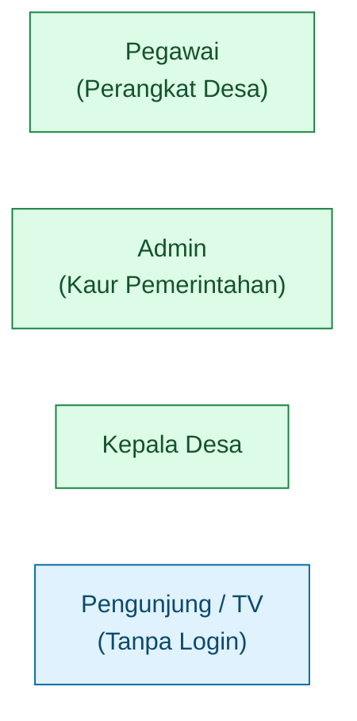

| Peran | Deskripsi |
|-------|-----------|
| **Pegawai** | Melakukan absensi harian, mengajukan izin/sakit, mencatat kegiatan, melihat riwayat pribadi. |
| **Admin** (Kaur Pemerintahan) | Mengelola data pegawai, jam kerja & lokasi, menyetujui/menolak izin, melihat absensi + foto, rekap, dan cetak laporan. |
| **Kepala Desa** | Dashboard ringkasan, melihat absensi + foto, **menyetujui/menolak izin**, serta laporan bulanan. |
| **Display Board** | Halaman publik tanpa login untuk TV — hanya menampilkan nama, jabatan, dan status. |

> **Catatan pembaruan**: Persetujuan/penolakan izin kini dapat dilakukan **oleh Admin maupun Kepala Desa**. Keduanya juga dapat melihat foto swafoto absensi pegawai.

## 6. Daftar Fitur Sistem

### 6.1 Autentikasi & Sesi
- Login dengan username + password (hash bcrypt `PASSWORD_DEFAULT`).
- Throttle login: 5 gagal/10 menit → kunci 15 menit.
- Cookie sesi `HttpOnly` + `SameSite=Lax` (+ `Secure` saat HTTPS).
- Umur sesi 60 menit; idle timeout 30 menit.
- Logout dengan konfirmasi + invalidasi sesi pada server.
- Informasi user yang login & tombol **Keluar** (merah) tampil di pojok kanan atas (topbar).

### 6.2 Otorisasi Berbasis Peran
- Middleware `PegawaiOnly`, `AdminOnly`, `KepalaOnly`, `AdminOrKepala`.
- Pelanggaran otorisasi → HTTP 403 + dicatat di audit log.

### 6.3 Absensi (Pegawai)
- Absen masuk normal (status `Hadir`), terlambat (status `Terlambat`, wajib alasan 10–500 karakter), dan absen pulang.
- Validasi swafoto kamera (JPEG/PNG ≤2 MB) + GPS dalam radius (default 100 m) dengan **rumus Haversine**.
- Otomatis ditolak jika di luar hari kerja / hari libur nasional.

### 6.4 Izin & Sakit
- **Pegawai**: ajukan izin/sakit (jenis, rentang tanggal, keterangan 10–500 karakter, lampiran PDF/JPG/PNG ≤2 MB).
- Validasi tumpang tindih tanggal & nomor referensi unik.
- **Admin & Kepala Desa**: daftar pengajuan menunggu (paginasi 25), setujui/tolak (alasan 3–500 karakter).
- Persetujuan otomatis merambat ke tabel `absensi` tiap hari kerja dalam rentang.

### 6.5 Register Kegiatan Harian
- Pegawai mencatat kegiatan (nama 3–200 karakter, jam mulai < jam selesai), hanya pada hari kerja.
- Log kegiatan seluruh pegawai juga tampil pada dashboard Admin & Kepala Desa.

### 6.6 Manajemen Pegawai (Admin)
- Tambah/ubah/nonaktifkan pegawai. Validasi NIP 18 digit & username unik.
- Penonaktifan mencabut sesi aktif + menolak login, riwayat tetap dipertahankan.

### 6.7 Pengaturan (Admin)
- Jendela jam (masuk_mulai, masuk_selesai, terlambat_selesai, pulang_mulai).
- Koordinat kantor (lat/lon), radius (10–5000 m), hari kerja (bitmask), nama desa.

### 6.8 Rekap & Laporan
- Rekap bulanan per pegawai aktif (Hadir/Terlambat/Izin/Sakit/Alpha + Total Hari Kerja).
- Detail harian per pegawai + **tombol lihat foto** masuk/pulang (modal).
- Cetak ramah peramban (Save as PDF) dengan kop, periode, tanggal cetak.

### 6.9 Daftar Absensi + Foto (Admin & Kepala Desa) — *fitur baru*
- Halaman `/admin/absensi` & `/kepala/absensi` menampilkan tabel absensi per tanggal.
- **Thumbnail foto masuk & pulang**, klik untuk modal besar lengkap timestamp + koordinat GPS.
- Baris "Belum Absen" untuk pegawai aktif yang belum mencatat kehadiran.

### 6.10 Dashboard
- Persentase kehadiran hari ini (2 desimal), pengelompokan pegawai per kategori, ringkasan rekap bulan berjalan, log kegiatan seluruh pegawai.

### 6.11 Display Board (Publik)
- Halaman TV tanpa login, auto-refresh 60 detik, indikator koneksi.
- Hanya membocorkan `{nama, jabatan, status}`.

### 6.12 Riwayat Pribadi (Pegawai)
- Riwayat absensi & izin bulan berjalan (default), filter 12 bulan terakhir.

### 6.13 Job Otomatis: Status Alpha
- Cron menetapkan `Alpha` untuk pegawai aktif yang tidak check-in & tidak ada izin disetujui.
- Idempoten; retry maksimal 3× jeda 5 menit saat gagal.

## 7. Matriks Hak Akses (Otorisasi)

| Fitur / Endpoint | Pegawai | Admin | Kepala Desa | Publik |
|------------------|:-------:|:-----:|:-----------:|:------:|
| Login / Logout | ✔ | ✔ | ✔ | — |
| Absen masuk/pulang | ✔ | — | — | — |
| Ajukan izin/sakit | ✔ | — | — | — |
| Catat kegiatan | ✔ | — | — | — |
| Riwayat pribadi | ✔ | — | — | — |
| Kelola pegawai | — | ✔ | — | — |
| Pengaturan jam & lokasi | — | ✔ | — | — |
| **Setujui/tolak izin** | — | ✔ | ✔ | — |
| **Lihat absensi + foto** | — | ✔ | ✔ | — |
| Rekap bulanan | — | ✔ | ✔ | — |
| Cetak laporan PDF | — | ✔ | ✔ | — |
| Dashboard | — | ✔ | ✔ | — |
| Display Board | — | — | — | ✔ |

## 8. Arsitektur Sistem

Pola **Modular MVC ringan** dengan front controller tunggal (`public/index.php`).

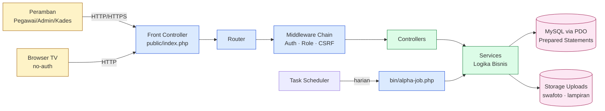

| Lapisan | Tanggung jawab |
|---------|----------------|
| Front Controller | Bootstrap (autoload, sesi, error handler, dispatch). |
| Router | Mapping URL → controller + middleware. |
| Middleware | `AuthMiddleware`, `RoleMiddleware` (Pegawai/Admin/Kepala/AdminOrKepala), `CsrfMiddleware`. |
| Controllers | Adapter HTTP — tidak berisi logika domain. |
| Services | Logika bisnis murni (validasi, transaksi, kalkulasi). |
| Domain (Enums) | `Role`, `AttendanceStatus`, `IzinStatus`, `IzinJenis`. |
| Repository / PDO | Akses MySQL via prepared statements. |
| Views | Template PHP + layout shared (Tailwind). |

## 9. Use Case Diagram

```mermaid
flowchart TB
  classDef actor fill:#fef9c3,stroke:#a16207
  classDef uc fill:#e0f2fe,stroke:#0c4a6e

  Pegawai((Pegawai)):::actor
  Admin((Admin)):::actor
  Kades((Kepala Desa)):::actor
  Public((Pengunjung TV)):::actor

  UC1[Login / Logout]:::uc
  UC2[Absen Masuk / Pulang]:::uc
  UC3[Ajukan Izin / Sakit]:::uc
  UC4[Catat Kegiatan]:::uc
  UC5[Lihat Riwayat Pribadi]:::uc
  UC6[Kelola Pegawai]:::uc
  UC7[Setujui / Tolak Izin]:::uc
  UC8[Atur Jam Kerja & Lokasi]:::uc
  UC9[Lihat Rekap Bulanan]:::uc
  UC10[Cetak Laporan PDF]:::uc
  UC11[Lihat Dashboard]:::uc
  UC12[Lihat Display Board]:::uc
  UC13[Lihat Absensi + Foto]:::uc

  Pegawai --> UC1 & UC2 & UC3 & UC4 & UC5
  Admin --> UC1 & UC6 & UC7 & UC8 & UC9 & UC10 & UC11 & UC13
  Kades --> UC1 & UC7 & UC9 & UC10 & UC11 & UC13
  Public --> UC12
```

## 10. Activity Diagram

### 10.1 Absensi Masuk

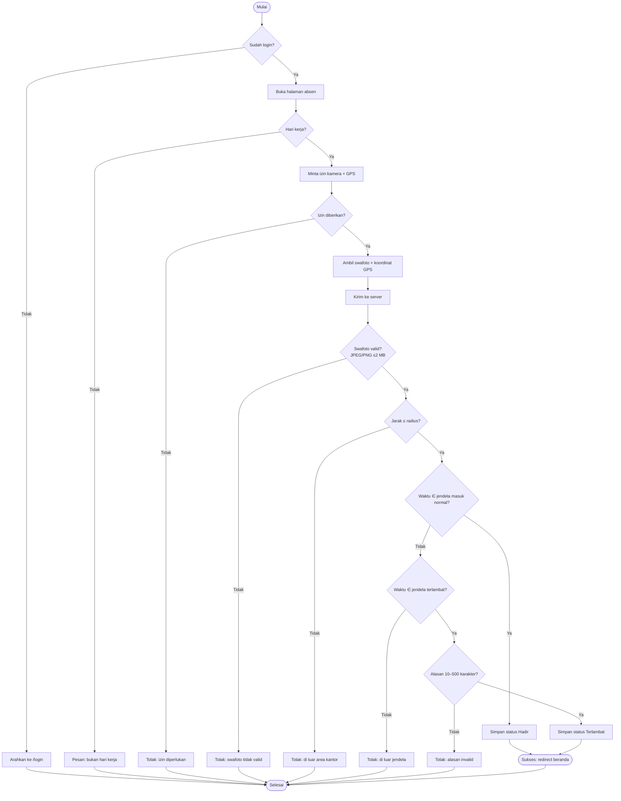

### 10.2 Persetujuan Izin (oleh Admin / Kepala Desa)

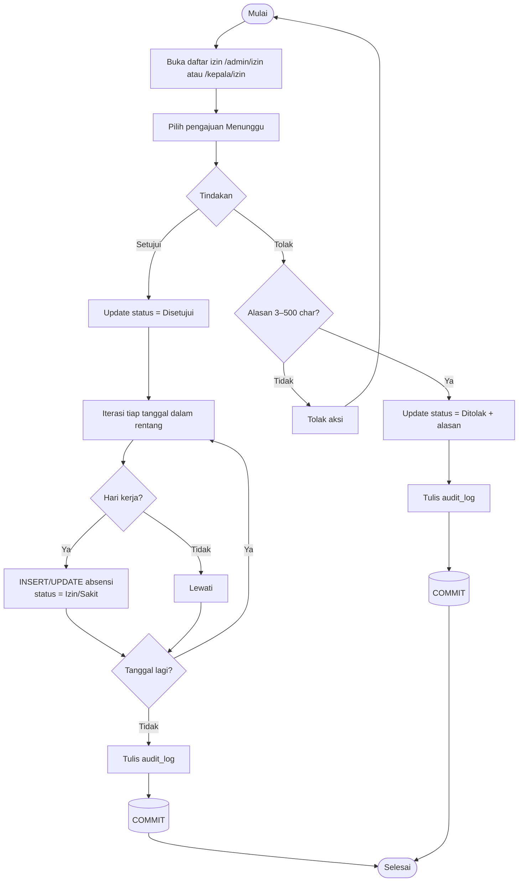

### 10.3 Job Penetapan Alpha

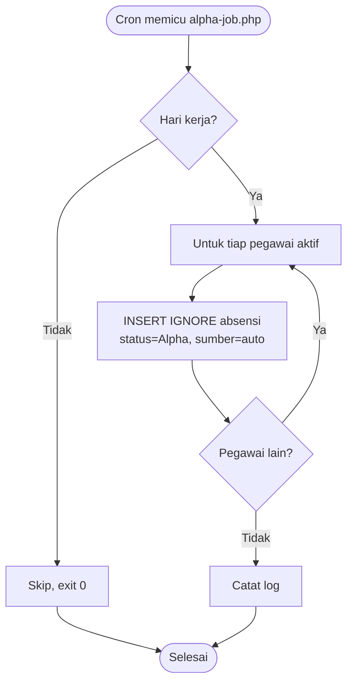

## 11. Sequence Diagram

### 11.1 Login

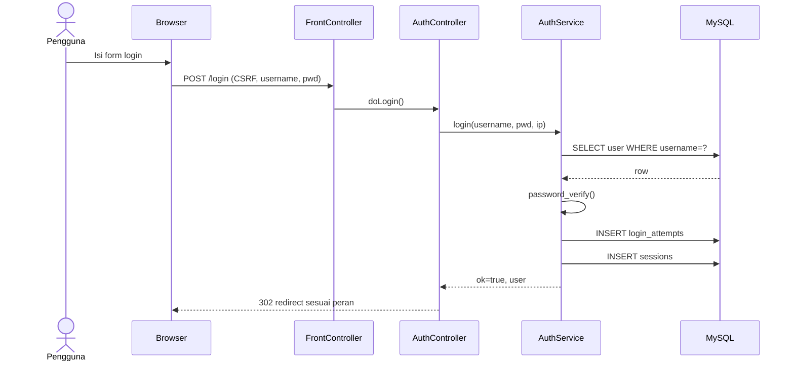

### 11.2 Absen Masuk

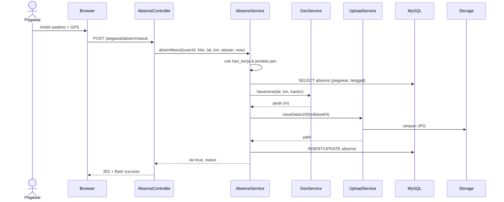

### 11.3 Persetujuan Izin (transaksi)

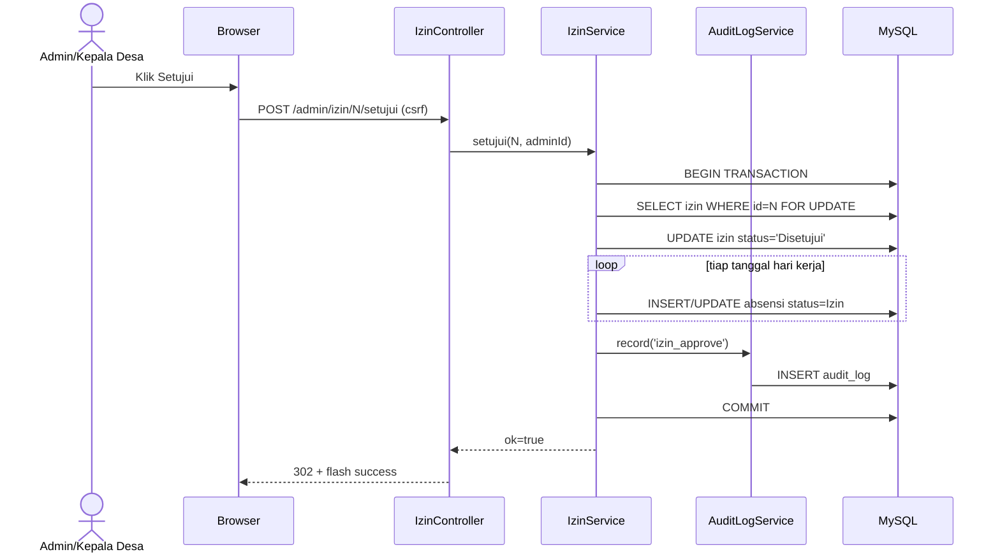

### 11.4 Lihat Foto Absensi (Admin/Kepala Desa)

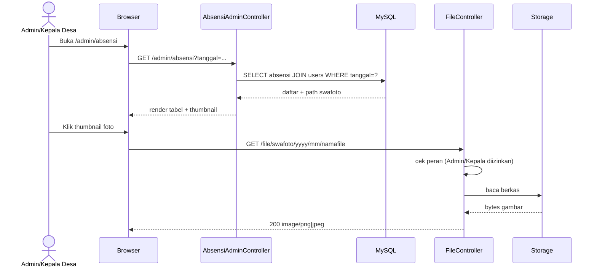

## 12. Class Diagram

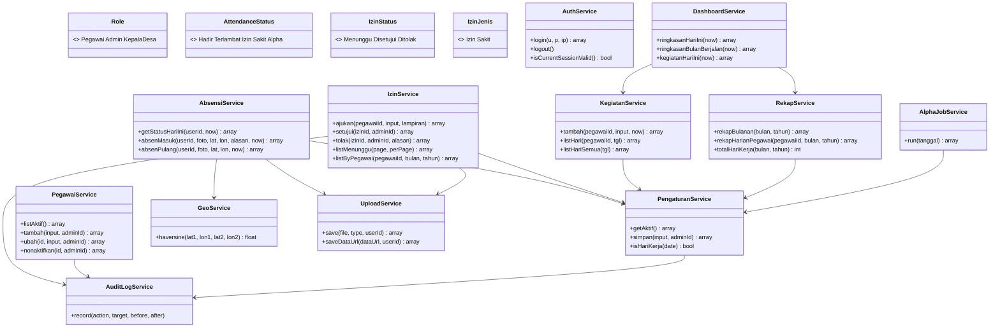

## 13. Entity Relationship Diagram (ERD)

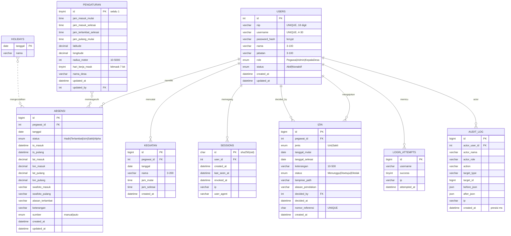

### Penjelasan Relasi

| Entitas | Relasi | Keterangan |
|---------|--------|-----------|
| `users` ↔ `absensi` | 1 : N | Tepat satu absensi per (pegawai_id, tanggal) — UNIQUE. |
| `users` ↔ `izin` | 1 : N (pemohon) + 1 : N (`decided_by`) | Pemohon vs admin/kepala yang memutuskan. |
| `users` ↔ `kegiatan` | 1 : N | Tiap kegiatan milik satu pegawai. |
| `users` ↔ `sessions` | 1 : N | Satu pegawai bisa beberapa sesi. |
| `pengaturan` ↔ `absensi` | logika | Pengaturan aktif memengaruhi keputusan absensi. |
| `holidays` ↔ `absensi` | logika | Hari libur mengecualikan pencatatan Alpha. |

### Constraint Penting

- `UNIQUE(pegawai_id, tanggal)` pada `absensi` — 1 catatan/hari/pegawai.
- `UNIQUE(username)`, `UNIQUE(nip)` pada `users`.
- `UNIQUE(nomor_referensi)` pada `izin`.
- `FK ... ON DELETE CASCADE` pada absensi/izin/kegiatan/sessions → users.
- `FK decided_by ON DELETE SET NULL` pada izin.
- `audit_log` append-only (hanya INSERT dari aplikasi).

## 14. Struktur Tabel Database

Skema lengkap: [`db/migration.sql`](db/migration.sql).

| Tabel | Peran | Indeks penting |
|-------|-------|----------------|
| `users` | semua akun | `UNIQUE(username)`, `UNIQUE(nip)`, `INDEX(status, role)` |
| `sessions` | sesi server | `INDEX(user_id)` |
| `login_attempts` | throttle login | `INDEX(username, attempted_at)` |
| `pengaturan` | satu baris (id=1) | — |
| `holidays` | hari libur nasional | PK `tanggal` |
| `absensi` | catatan harian + foto | `UNIQUE(pegawai_id, tanggal)`, `INDEX(tanggal)` |
| `izin` | pengajuan izin/sakit | `UNIQUE(nomor_referensi)`, `INDEX(pegawai_id, status, tanggal_mulai, tanggal_selesai)` |
| `kegiatan` | register kegiatan | `INDEX(pegawai_id, tanggal, jam_mulai)` |
| `audit_log` | jejak aksi sensitif | `INDEX(action, created_at)`, `INDEX(actor_user_id)` |

## 15. Aturan Bisnis

1. Tepat satu absensi per (pegawai, tanggal) — di-enforce DB (UNIQUE) + service.
2. Keputusan GPS bergantung pada `jarak Haversine ≤ radius` (simetris & refleksif).
3. Status absensi mengikuti jendela waktu pengaturan aktif (bukan hardcoded).
4. Job Alpha idempoten (eksekusi ulang menghasilkan state identik).
5. Persetujuan izin merambat ke absensi dalam transaksi atomik (rollback bila audit gagal).
6. State machine izin: hanya `Menunggu` → `Disetujui`/`Ditolak`; final immutable.
7. Penonaktifan pegawai memutus sesi & menolak login, riwayat dipertahankan.
8. Pengaturan baru hanya berlaku ke depan.
9. Audit log append-only.
10. Display Board hanya membocorkan `{nama, jabatan, status}`.
11. Persetujuan/penolakan izin boleh dilakukan Admin **atau** Kepala Desa.

## 16. Validasi Input

| Modul | Field | Aturan |
|------|-------|--------|
| Login | username | non-empty, ≤ 50 karakter |
| Login | password | 8–72 karakter |
| Pegawai | nip | 18 digit numerik, unik |
| Pegawai | username | 4–30 alfanumerik, unik |
| Pegawai | password awal | 8–72 karakter |
| Pegawai | nama, jabatan | 3–100 karakter |
| Pengaturan | jam_* | `HH:MM` valid; masuk_mulai < masuk_selesai < terlambat_selesai |
| Pengaturan | latitude | −90..90 |
| Pengaturan | longitude | −180..180 |
| Pengaturan | radius_meter | 10..5000 |
| Absensi | swafoto | image/jpeg|png, ≤ 2 MB |
| Absensi | alasan_terlambat | 10–500 karakter |
| Absensi | lat/lon | jarak Haversine ≤ radius |
| Izin | jenis | Izin / Sakit |
| Izin | tanggal_* | `YYYY-MM-DD` valid (`checkdate`), mulai ≤ selesai |
| Izin | keterangan | 10–500 karakter |
| Izin | lampiran | pdf/jpeg/png, ≤ 2 MB |
| Izin (admin) | alasan_penolakan | 3–500 karakter |
| Kegiatan | nama | 3–200 karakter |
| Kegiatan | jam_* | `HH:MM`, mulai < selesai |
| Rekap | bulan / tahun | 1..12 / 2020..tahun berjalan |
| Riwayat | periode | maksimum 12 bulan terakhir |

## 17. Keamanan Sistem

Sistem menerapkan prinsip *defense in depth* berlapis:

1. **Otentikasi** — bcrypt (`password_hash`/`password_verify`), tidak menyimpan plaintext; throttle login 5×/10 menit → kunci 15 menit; pesan error generik (anti enumeration); validasi panjang sebelum query DB.
2. **Manajemen Sesi** — cookie `HttpOnly` + `SameSite=Lax` (+`Secure` HTTPS); lifetime 60 menit + idle 30 menit; sesi tersimpan di tabel `sessions` (`sha256(sid)`) sehingga dapat di-revoke; `session_regenerate_id` setelah login.
3. **Otorisasi** — middleware berbasis peran (`PegawaiOnly`, `AdminOnly`, `KepalaOnly`, `AdminOrKepala`); pelanggaran → HTTP 403 + audit log.
4. **CSRF** — token 32-byte per sesi (valid 60 menit), diverifikasi pada seluruh request POST/PUT/PATCH/DELETE; gagal → HTTP 419.
5. **SQL Injection** — seluruh query memakai **PDO prepared statements**, tanpa konkatenasi input.
6. **XSS** — output di-escape via `htmlspecialchars($v, ENT_QUOTES, 'UTF-8')` (helper `e()`).
7. **Upload aman** — validasi MIME via `finfo` + whitelist ekstensi; ukuran swafoto/lampiran ≤ 2 MB (global ≤ 5 MB); nama file acak; `.htaccess` menonaktifkan eksekusi PHP di `storage/uploads`; akses berkas hanya lewat endpoint terotentikasi `GET /file/{type}/{year}/{month}/{name}` dengan pengecekan peran.
8. **Audit log** — append-only, presisi milidetik, zona WIB; ditulis dalam transaksi DB (gagal log → rollback).
9. **Waktu kanonik** — `Asia/Jakarta` di PHP, `SET time_zone='+07:00'` di MySQL; seluruh timestamp dari clock server.
10. **Operasional** — disarankan HTTPS di produksi (aktifkan `Secure` cookie), kredensial DB tidak di-commit.

## 18. Audit Log

| Action | Target | Before | After |
|--------|--------|--------|-------|
| `user_create` | user | — | data baru |
| `user_update` | user | snapshot lama | snapshot baru |
| `izin_approve` | izin | status=Menunggu | status=Disetujui |
| `izin_reject` | izin | status=Menunggu | status=Ditolak + alasan |
| `pengaturan_update` | pengaturan | nilai lama | nilai baru |
| `authorization_denied` | route | — | path, method, role |

Kolom `created_at` bertipe `DATETIME(3)` (presisi milidetik, ISO 8601 WIB).

## 19. Daftar Routing (Endpoint)

| Method | Path | Peran | Keterangan |
|--------|------|-------|-----------|
| GET | `/login` | publik | Form login |
| POST | `/login` | publik | Proses login |
| GET/POST | `/logout` | terautentikasi | Konfirmasi & proses logout |
| GET | `/display` | publik | Display board TV |
| GET | `/display/data` | publik | Data JSON display board |
| GET | `/file/{type}/{year}/{month}/{name}` | terautentikasi | Unduh swafoto/lampiran |
| GET | `/pegawai` | Pegawai | Beranda pegawai |
| GET | `/pegawai/absen` | Pegawai | Form absensi |
| POST | `/pegawai/absen/masuk` | Pegawai | Absen masuk |
| POST | `/pegawai/absen/pulang` | Pegawai | Absen pulang |
| GET | `/pegawai/izin` | Pegawai | Daftar izin pribadi |
| GET/POST | `/pegawai/izin/baru` | Pegawai | Form & submit izin |
| GET/POST | `/pegawai/kegiatan` | Pegawai | Register kegiatan |
| GET | `/pegawai/riwayat` | Pegawai | Riwayat pribadi |
| GET | `/admin` | Admin | Dashboard admin |
| GET | `/admin/absensi` | Admin & Kepala | Daftar absensi + foto |
| GET/POST | `/admin/pegawai*` | Admin | Manajemen pegawai |
| GET | `/admin/izin` | Admin & Kepala | Daftar pengajuan menunggu |
| POST | `/admin/izin/{id}/setujui` | Admin & Kepala | Setujui izin |
| POST | `/admin/izin/{id}/tolak` | Admin & Kepala | Tolak izin |
| GET/POST | `/admin/pengaturan` | Admin | Pengaturan sistem |
| GET | `/admin/rekap` | Admin | Rekap bulanan |
| GET | `/admin/laporan/print` | Admin | Laporan ramah cetak |
| GET | `/kepala` | Kepala Desa | Dashboard kepala desa |
| GET | `/kepala/absensi` | Kepala Desa | Daftar absensi + foto |
| GET | `/kepala/izin` | Kepala Desa | Daftar pengajuan menunggu |
| POST | `/kepala/izin/{id}/setujui` | Kepala Desa | Setujui izin |
| POST | `/kepala/izin/{id}/tolak` | Kepala Desa | Tolak izin |
| GET | `/kepala/laporan` | Kepala Desa | Rekap bulanan |
| GET | `/kepala/laporan/print` | Kepala Desa | Laporan ramah cetak |

## 20. Struktur Direktori

```
sapa-desa/
├── public/
│   ├── index.php              # front controller
│   ├── router.php             # router untuk PHP built-in server
│   ├── .htaccess
│   └── assets/theme.css       # design tokens shadcn-style
├── src/
│   ├── autoload.php
│   ├── routes.php
│   ├── Core/                  # Db, Router, Request, Response, Session, Csrf, Time, View, Logger, App, Config
│   ├── Middleware/            # Auth, Csrf, PegawaiOnly, AdminOnly, KepalaOnly, AdminOrKepala
│   ├── Controllers/           # Auth, PegawaiHome, Izin, Kegiatan, PegawaiAdmin, Pengaturan,
│   │                          # Rekap, Laporan, AdminHome, Kepala, Riwayat, DisplayBoard,
│   │                          # File, AbsensiAdmin
│   ├── Services/              # Auth, Absensi, Izin, Kegiatan, Pegawai, Pengaturan, Rekap,
│   │                          # Dashboard, AlphaJob, Geo, Upload, AuditLog
│   └── Domain/Enums/          # Role, AttendanceStatus, IzinStatus, IzinJenis
├── config/                    # app.php, database.php
├── db/                        # migration.sql, seed.sql
├── storage/
│   ├── uploads/               # swafoto/ , izin/  (.htaccess deny PHP)
│   └── logs/
├── templates/                 # layouts, auth, pegawai, admin, kepala, display, laporan, partials, errors
├── bin/                       # install.php, alpha-job.php, check-db.php, test-*.php
├── .kiro/specs/               # requirements, design, tasks
├── README.md
└── LAPORAN.md                 # dokumen ini
```

## 21. Instalasi & Menjalankan

### Prasyarat
- Windows + Laragon (atau Linux + Apache/Nginx)
- PHP 8.1+ (`pdo_mysql`, `fileinfo`), MySQL 8.x

### Instalasi
```bat
:: 1. Pastikan MySQL aktif, lalu jalankan installer (buat DB, tabel, akun default)
php bin\install.php
```

### Menjalankan
```bat
:: Opsi A — Apache Laragon
:: akses http://localhost/sapa-desa/public/

:: Opsi B — PHP built-in server (gunakan router script!)
php -S 127.0.0.1:8088 -t public public/router.php
:: akses http://127.0.0.1:8088
```

> **Penting**: pada PHP built-in server gunakan `public/router.php` agar URL berkas (`/file/...png`) diteruskan ke aplikasi, bukan dianggap berkas statis.

### Akun Default

| Username | Password | Peran |
|----------|----------|-------|
| `admin` | Password123 | Admin |
| `kades` | Password123 | Kepala Desa |
| `pegawai1` | Password123 | Pegawai |

> Wajib ganti password default sebelum produksi.

### Job Alpha (Task Scheduler)
```
Program: D:\laragon\bin\php\php-8.3.30-Win32-vs16-x64\php.exe
Arguments: D:\laragon\www\sapa-desa\bin\alpha-job.php
Trigger: Harian 16:30 (Senin–Jumat)
```

## 22. Pengujian

| Skrip | Cakupan |
|-------|---------|
| `php bin\smoke-test.php` | Unit: Haversine (refleksif/simetris/satuan), CSRF, escaping XSS. |
| `php bin\test-flow.php` | E2E HTTP: login per peran, otorisasi matrix, logout, display board, CSRF. |
| `php bin\test-comprehensive.php` | Validasi penuh: Pengaturan, Pegawai, Izin (tanggal/overlap/propagasi), Kegiatan, Absensi (GPS/jendela/swafoto), Rekap, payload Display. |

> Untuk test E2E, server PHP harus berjalan di `127.0.0.1:8088`.

## 23. Pemetaan ke Bab Laporan

| Bab Laporan | Bagian Dokumen Ini |
|-------------|--------------------|
| **Bab I — Pendahuluan** (latar belakang, tujuan, manfaat, ruang lingkup) | §1, §2, §3 |
| **Bab II — Landasan Teori** (teknologi) | §4 |
| **Bab III — Analisis & Perancangan** (aktor, fitur, hak akses, arsitektur, UML, ERD, tabel, aturan bisnis, validasi) | §5–§16 |
| **Bab IV — Implementasi & Pengujian** (keamanan, audit, routing, struktur, instalasi, pengujian) | §17–§22 |
| **Bab V — Penutup** (kesimpulan & saran) | rangkum dari fitur §6 + pengembangan lanjut |

### Saran Pengembangan Lanjut
- Integrasi dompdf/mpdf untuk PDF biner asli.
- Notifikasi WhatsApp/Telegram saat izin disetujui.
- Mode dark theme (tokens sudah disiapkan di `theme.css`).
- Export rekap ke Excel (`.xlsx`).
- Fitur cuti tahunan berkuota & multi-desa (multi-tenant).

---

### Tips Render Diagram untuk Word/PDF
1. Buka file ini di VS Code + ekstensi *Markdown Preview Mermaid Support* → screenshot diagram.
2. Atau salin tiap blok `mermaid` ke <https://mermaid.live> → Export PNG/SVG → sisipkan ke dokumen laporan.

> Dokumen internal untuk Pemerintah Desa Wadas. Dibangun dengan PHP native, MySQL, dan Tailwind CSS (gaya shadcn/ui + Aceternity UI).
